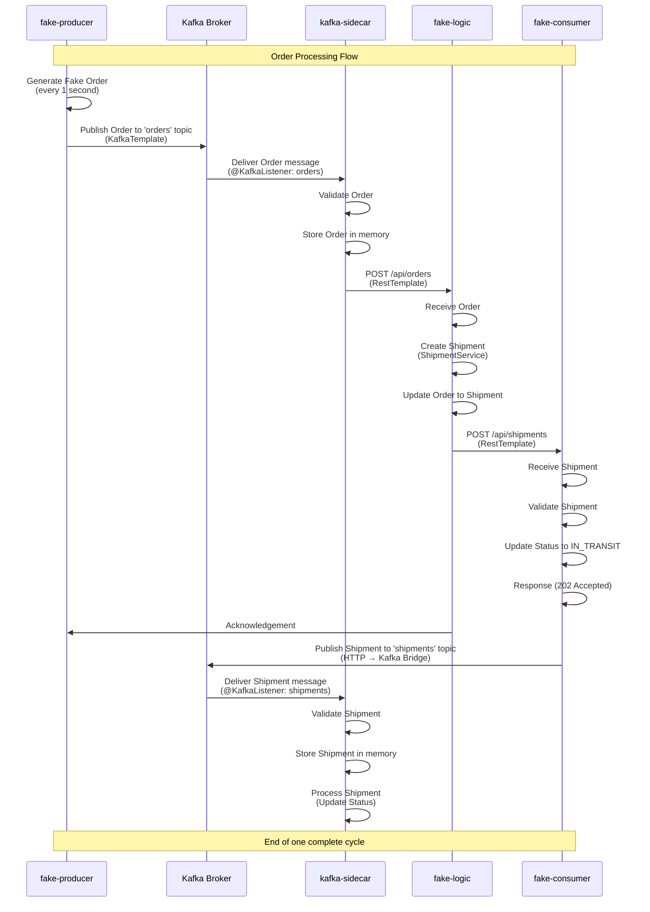

# kafka-sidecar
Kafka sidecar for Kubernetes converting Kafka communication into HTTP to simplify business logic implementation

## Requirements

### Java Version
- **Java 21 or higher** (LTS - Long Term Support)
- Recommended: Eclipse Temurin 21, OpenJDK 21, or GraalVM 21
- Required for: Modern Java features (pattern matching, virtual threads, text blocks)

#### Check Your Java Version
```bash
java -version
# Output should show: openjdk 21.x.x or later
```

#### Install Java 21
```bash
# macOS with Homebrew
brew install eclipse-temurin@21

# Or using OpenJDK
brew install openjdk@21

# Verify installation
java -version
```

### Other Requirements
- Maven 3.6+ (included via `./mvnw` wrapper)
- Kubernetes CLI (for K8s targets)
- Helm 3+ (for Helm deployment)

## Building with Java Makefile.java

The project uses a modern Java 21-based build system that runs as a script without compilation.

### Quick Start

```bash
# Show available targets
java Makefile.java help

# Build project (fastest, no tests)
java Makefile.java build

# Build with tests
java Makefile.java build-tests

# Clean artifacts
java Makefile.java clean
```

### Build Targets

| Target        | Description                     |
|---------------|---------------------------------|
| `build`       | Build all modules without tests |
| `build-tests` | Build with full test suite      |
| `clean`       | Clean build artifacts           |
| `test`        | Run unit tests                  |


### Kubernetes/Helm Targets

```bash
java Makefile.java helm-install    # Deploy to K8s
java Makefile.java helm-upgrade    # Update deployment
java Makefile.java helm-status     # Show status
java Makefile.java k8s-status      # Show K8s resources
```

### Optional: Shell Aliases

Add to `~/.zshrc` or `~/.bashrc`:

```bash
alias jbuild='java Makefile.java build'
alias jtest='java Makefile.java test'
alias jdocker='java Makefile.java docker-build'
alias jhelm='java Makefile.java helm-install'
```

Then use: `jbuild`, `jtest`, `jdocker`, `jhelm`

## How It Works

Java 21 allows running `.java` files directly as scripts without compilation:

```bash
# Modern way (Java 21+)
java Makefile.java build

# Traditional way (still works)
javac Makefile.java && java -cp . KafkaSidecarBuild
```

## Troubleshooting

### "java: command not found"
```bash
brew install eclipse-temurin@21
java -version
```

### "Cannot find symbol" error
```bash
# Ensure Java 21 or higher
java -version

# Verify your PATH
which java
```

### Build fails
```bash
# Make mvnw executable
chmod +x ./mvnw

# Clean and rebuild
java Makefile.java clean
java Makefile.java build
```

## Performance

| Operation        | Time          |
|------------------|---------------|
| Build            | 5-10 seconds  |
| Build with tests | 20-30 seconds |
| Docker build     | 2-5 minutes   |
| Helm install     | 30-60 seconds |

## System Architecture

### Complete Data Flow (UML Sequence Diagram)



### Component Interactions

| Phase | Source | Destination | Protocol | Purpose |
|-------|--------|-------------|----------|---------|
| 1 | fake-producer | Kafka | KafkaTemplate | Produce orders |
| 2 | Kafka | kafka-sidecar | @KafkaListener | Consume orders |
| 3 | kafka-sidecar | fake-logic | HTTP RestTemplate | Forward orders |
| 4 | fake-logic | fake-consumer | HTTP RestTemplate | Forward shipments |
| 5 | fake-consumer | Kafka | KafkaTemplate | Publish shipments |
| 6 | Kafka | kafka-sidecar | @KafkaListener | Consume shipments |

### Kafka Topics

| Topic | Producer | Consumer | Partitions | Purpose |
|-------|----------|----------|-----------|---------|
| `orders` | fake-producer | kafka-sidecar | 3 | Order distribution |
| `shipments` | fake-consumer | kafka-sidecar | 1 | Shipment tracking |

### Consumer Groups

| Group | Service | Topics | Purpose |
|-------|---------|--------|---------|
| `kafka-sidecar-group` | kafka-sidecar | orders | Order consumption |
| `kafka-sidecar-shipment-group` | kafka-sidecar | shipments | Shipment consumption |

## Documentation

- **ARCHITECTURE.md** - Detailed system design and data flow documentation
- **JAVA_BUILD_QUICK_REF.md** - Quick reference for build commands
- **KUBERNETES_DEPLOYMENT.md** - Kubernetes setup
- **HELM_DEPLOYMENT.md** - Helm chart deployment
- **Makefile.java** - Build system implementation
